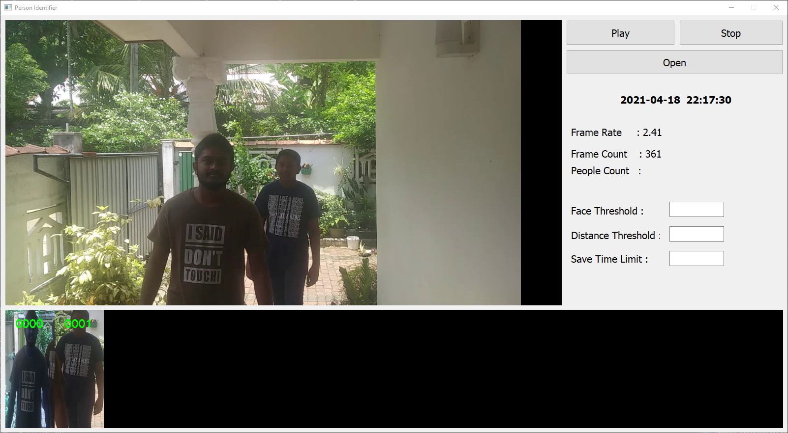

# Adaptive people movement and action prediction using CCTV to control appliances

#### Table of content

1. [Introduction](#intro)
2. [Prerequisites](#requirments)
3. [Installation](#installation)
4. [How to Run](#how-to-run)
5. [Results](#results)

## Introduction

## Prerequisites
  1. Install CUDA tool kit and the CuDNN 
        <br/>-https://developer.nvidia.com/cuda-toolkit-archive
        <br/>-https://developer.nvidia.com/cudnn
  
  2. Install Anaconda Python Package Manager
        <br/>-https://www.anaconda.com/products/individual 

## Installation
 1. Create an Environment in Anaconda with <b>Python 3.7</b>
 2. Install PyTorch - (For Windows 10  Conda Environment with Python and CUDA 10.1 - use Pytorch 1.8.1 as follow)  
    <b>OR</b> download the appropriate PyTorch version from - https://pytorch.org
    ```bash
    conda install pytorch torchvision torchaudio cudatoolkit=10.2 -c pytorch
    ```  
    To check if PyTorch is properly installed, use the following command in a python instance.  
    If pytorch is properly installed,  
        <b>torch.cuda.is_available()</b> should return <b>True</b> and  
        <b>torch.cuda.get_device_name()</b> should return the name of your GPU card.
    ```python
    import torch
    torch.cuda.is_available()
    torch.cuda.get_device_name()
    ```  
 3. Clone this repository.
    ```bash
    git clone https://github.com/cepdnaclk/e15-4yp-human-behavior-prediction-using-cctv.git
    ``` 
 4. Download the weight files for (YOLO, ReID, OpenPose, Action) from the following link
     ```bash
     https://drive.google.com/drive/folders/13IzO-skjxj-kRSScbuYjoRYKTW-P3eaB?usp=sharing
     ```  
    Move the 'ModelFiles' folder to the 'code' folder.  
    (If you download the weight files one by one, create the 'ModelFiles' folder inside 'code' and put the weight files in it)
    
 5. Download the demo video files from the following link  
    ```bash
    https://drive.google.com/drive/folders/1bP9OHtpQ9oY0C3mLkViN8HfQ8jQ2DteV?usp=sharing
    ```  
    Move the 'Demo' folder to the 'code' folder.  
    (If you download the demo files one by one, create the 'Demo' folder inside 'code' and put the demo files in it)
    
 6. Download the Image Database file from the following link
    ```bash
    https://drive.google.com/drive/folders/1sZnGMVUAc1gHMI94iBfFhcNTxbGgbXKC?usp=sharing
    ```  
    Move the 'ImageDatabase' folder to the 'code' folder.  
    (If you download the files one by one, create the 'ImageDatabse' folder inside 'code' and put the files in it)
 
 7. The final Folder Structure should be as follow.    
    ```
    e15-4yp-human-behavior-prediction-using-cctv
    ├── README.md
    ├── docs
    └── code
        ├── BehaviorExtraction
        ├── BehaviorPrediction
        ├── Demo
        |   ├── CCTV_Low.mp4
        |   └── Entrance_2.mp4
        ├── ImageDatabase
        |   ├── Faces
        |   |   ├── 0000
        |   |   ├── 0001
        |   |   ├── ...
        |   |   └── faces.pt
        |   └── Human
        |       └── 2021-04-15
        |           ├── 0000
        |           ├── 0001
        |           ├── ...
        |           └── today
        ├── ModelFiles
        |   ├── action
        |   |   └── model.pickle
        |   ├── openpose
        |   |   └── openpose_model.pth
        |   ├── reid
        |   |   └── reid_model.pth
        |   └── yolo
        |       ├── yolov3.cfg
        |       └── yolovo3.weights
        ├── PersonIdentification
        ├── CCTVObserver.py
        ├── FaceObserver.py
        ├── face.png
        └── face_2.png
    ```  
## How to Run
 
 1. CD in to the 'e15-4yp-human-behavior-prediction-using-cctv' folder and start an instance of the conda environment.  
    Then run the following command.  
    ```bash
    pip install -r Requirements.txt    
    ```  
    
 2. Execute the following steps while keeping the cmd in 'code' folder and in the conda environment.  
    Generate features for the faces:  
    ```bash
    python PersonIdentification/FaceGenerate.py  
    ```  
    (If you want to try a seperate video, create another folder inside ImageDatabase/Faces following the naming convention and  
    put more than 10 face images of the person you want to recognize inside that folder.)  
      
        
        
    Run the face Observer:
    ```bash
    python FaceObserver.py 
    ```  
      
        
    Generate features for the re-identification:  
    (If you are running the demo files, copy the files under the date '2021-04-15' in ImageDatabase/Humans and 
    paste them under a folder with the name of the current date.  
    <b>This contains more images to increase the performance drastically </b>)  
    ```bash
    python BehaviorExtraction/HumanGenerate.py 
    ```  
      
        
    Run the Human detector:  
    ```bash
    python CCTVObserver.py
    ```  
    
## Results
#### Person Body Identification Interface


#### Behavior Data Extraction Interface

