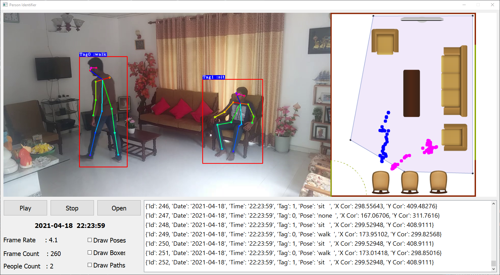
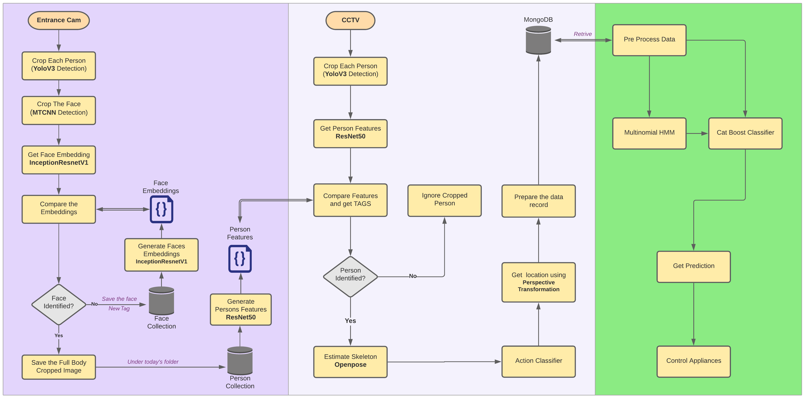
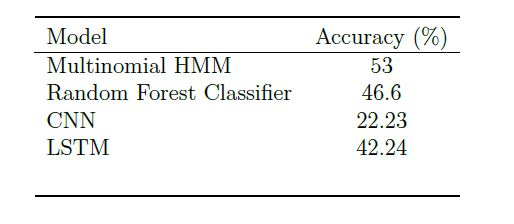
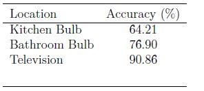

[comment]: # "This is the standard layout for the project, but you can clean this and use your own template"

# Adaptive people movement and action prediction using CCTV to control appliances

#### Team

- E/15/010, Ruchika Alwis, [email](mailto:e15010@eng.pdn.ac.lk)
- E/15/265, Risith Perera, [email](mailto:risithperera@eng.pdn.ac.lk)
- E/15/347, Isuru Sudasinghe, [email](mailto:isuru.sudasinghe@eng.pdn.ac.lk)

#### Supervisors

- Eng. (Dr.) Kamalanath Samarakoon, [email](mailto:kamalanath@eng.pdn.ac.lk)

#### Table of content

1. [Abstract](#abstract)
2. [Related works](#related-works)
3. [Methodology](#methodology)
4. [Experiment Setup and Implementation](#experiment-setup-and-implementation)
5. [Results and Analysis](#results-and-analysis)
6. [Conclusion](#conclusion)
7. [Publications](#publications)
8. [Links](#links)

---

## Abstract

With the availability of high-performance processors
and GPUs, the demand for Machine learning, Deep learning
algorithms is growing exponentially. It has become more and
more possible to explore the depths of fields like Computer
vision with these trends. Detecting humans in video footage using
computer vision is one such area. Although human detection is
somewhat primitive when compared to today’s technology, using
that data to produce various results like recognizing postures,
predicting behaviors, predicting paths are very advanced fields
and they have very much room left to grow. Various algorithms,
approaches are available today to accomplish the above kind of
tasks, from classical machine learning, neural networks to statistical
approaches like Bayes theorem, Hidden Markov Models,
Time series, etc. This paper summarize the result of a system
that combines above technologies in order to control electric
appliances through predictions. These predictions are deducted
by analyzing CCTV footages of the user using computer vision.

## Related works

various approaches to analyze video footage in order to produce results like human tracking, path prediction, action recognition, action/behavior prediction, etc. as well as used existing data to make behavior predictions as well. There are many inbuilt libraries that are widely used in these researches such as Alpha pose, Open pose, Vent that produce very good results. It can be noticed that
most methods used to detect involves some sort of machine learning or deep learning algorithms. These models, therefore, have to be trained with a reasonable amount of data in order to get good results. Therefore, it can be observed that many propose using already trained algorithms unless the paper is about improving or proposing new algorithms itself. Another observable factor is that many approaches use various other techniques prior to the use of a machine learning or deep learning algorithm in the end. There are instances where saliency maps are used to enhance the prediction of path detection algorithms, use of separate feature extraction algorithms, etc. On the other hand, prediction is the most difficult part out of the two aspects mentioned above. Prediction algorithms are very sensitive to variation in tiny details and produce considerable deviations. Even the position of camera placement
has a drastic impact on the final result in prediction scenarios. For prediction approaches it can observe that researchers have successfully attempted techniques like Convolutional Neural Networks (CNN), Recurrent Neural Networks (RNN)all the way to algorithms like Markov Chains, Hidden Markov
Models (HMM), Hierarchical Representation, Time Series Analysis.

## Methodology

As mentioned in the introduction, the complete system consists of three separate components that can be run on three separate PCs if required. These components are Human Identification, Behavior Extraction, and Behavior Prediction. Within these subsystems, there are four software components as face recognition, human detection and tracking, action recognition, and behavior prediction.

A. Face recognition
Different methods of image processing and machine learning techniques have been used in this component. More weight was taken on improving the accuracy and the execution time. Initially, the python face-recognition package was used which has been implemented on top of dib, which is a C++
toolkit containing machine learning algorithms. But it has low accuracy and less performance. In order to obtain the desired outcome, the desired outcome python package is used to perform face detection using MTCNN and face identification using an Inception Resnet model. It is pre-trained on the
VGGFace2 dataset. More advanced implementation details can be found on the GitHub Repository - GitHub the whole process is separated into three parts which are face detection, getting face embeddings, and finally, identifying faces by measuring the distance between embeddings
in a specific frame. Face identification can be easily applied to raw images by first detecting faces using MTCNN before calculating embedding or probabilities using a before calculating model. It gives huge performance improvement rather than sending the entire frame to the Resnet model for getting
face embeddings.

B. Human detection and tracking
Here YOLO v3 is used to detect humans. YOLO v3 is
selected for the detection due to its speed while giving fairly accurate results at the same time. Although it is possible to detect humans using and track them using a model possible to, that approach was discarded due to the overhead created when running such heavy models’ side by side. Therefore, the current implementation is, first detect and crop each person in the frame using the YOLO object classification model. And then send each cropped person image to the Reid model. Since this Reid model was implemented sunporch, proper Porch implementation of YOLO has to be
used instead of TensorFlow implementation. Because when different implementations of TensorFlow adaptors run at the same time, the GPU memory can be crashed. Further details of that Porch YOLO implementation can be found on the GitHub Repository - PyTorch-YOLOv3. The Porch Reid model is based on the works by Zheng et al. There is a Reid model Baseline (PCB) that conducts uniform partition on the conv-layer for learning part-level features. It does not explicitly partition the images. PCB takes a whole image as the input and outputs a convolutional feature. Being classification net, the architecture of PCB is concise, with slight modifications on the backbone network. The training
procedure is standard and requires no bells and whistles. It shows that the convolutional descriptor has a much higher discriminative ability than the commonly used fully-connected (FC) descriptor. In order to identify the same person from different perspectives, it is required to have a collection of all persons’ images that we are going to identify in our domain. That’s where the face identification section comes into place. Once a person has identified from his face through the entrance camera, that person’s full-body image is saved in the human database under the current date folder. This is done because the same person can wear different clothes on different days. Then periodically generates features of every person in the current day folder and saves it as a single matrix file. Now in the human tracking part, first, the feature matrix file is loaded from the folder corresponding to the current day. Then humans in the current frame are detected using YOLO and features are extracted from the Reid model. These features are compared with each individual feature within the file collection and find the person tag. This implementation is somewhat similar to the approach we used in face identification.

C. Action Recognition
To identify actions performed by each individual person of the frame, first, the pose or the skeleton of the person has tube estimated. To do that, Porch implementation of opposes used. It produces 18 joint points of the person. Further implementation details can be found in the GitHub Repository- GitHub. Once the joints points are obtained then itis sent to an action classifier to determine the action. A window of five frames is used to extract features of body velocity, normalized joint positions, and joint velocities. Then mean filtering the prediction scores between 2 frames. Get a label of the person if the score is larger than a certain threshold. Here, a pre-trained action classifier provided by the GitHub Repository - Realtime-Action-Recognition is used to obtain the action identification.

#### Behavior Data Extraction Interface

D. Behavior prediction
There are two Machine learning algorithms used in the prediction model. One Algorithm is used to get the next location while the other algorithm is used to determine the state of the electric bulbs. Due to the constraints in the timeframe to create a totally new database from scratch, a mock database has to be created for this. The Final data-set needs tube of the structure in Table I. The public data-set we selected to create the mock data set has the structure in Table II. This dataset consists of readings taken from motion sensors, pressure sensors that were taken in fixed time intervals. This raw data is then used to predict the movement of the owner inside the house. After processing the data-set based on multiple assumptions, a mock data-set is created that has the required data structure as in Table I.
processed gain before feeding into the classifier. First of all, multiple sets of sequences of locations are made using the following inferences. To predict the state of the electric appliance, a cat Boost Classifier is used. And the above sequences, along with the result from HMM is used to make the prediction on the state of the device.

## Experiment Setup and Implementation

Camera distortion removal
Camera distortion removal is carried out by calculating the camera matrix that is
described in the chapter 3. Implementation of this procedure to find the camera matrix
is carried out as following.

In the process of calibration, we calculate the camera parameters by a set of know 3D
points (Xu, Xu) and their corresponding pixel location (u, v) in the image.
For the 3D points, checkerboard pattern with known dimensions at many different
orientations are photographed using the IP camera. Here a checkerboard pattern is used
because Checkerboard patterns are distinct and easy to detect in an image. Not only
that, the corners of squares on the checkerboard are ideal for localizing them because
they have sharp gradients in two directions. In addition, these corners are also related by
the fact that they are at the intersection of checkerboard lines. All these facts are used to
robustly locate the corners of the squares in a checkerboard pattern

Face Identification
Different methods of image processing and machine learning techniques are used in this
section. More weight is taken on improving the accuracy and the execution time. Initially
we used face recognition python package which is implemented on top of dib that is
a C++ toolkit containing machine learning algorithms. But it has low accuracy and
less performance. In order to obtain our desired outcome, the dib python
package is used to perform face detection using MTCNN and face identification using
an Inception Resnet model. It is pre-trained on VGGFace2 dataset. More advanced
implementation details can be found on the GitHub Repository - GitHub.

Human detection and tracking
In this section we want to give the same tag number to each individual person anytime
he travels through the field of view of the CCTV camera. To do that our early plan
was to get a bounding box using YOLO and track the person using Deep Sort and If a
person’s track was broken then we find his previous track number using the above Reid
model. But when looking at the performance of this Reid model we decided to get rid of
Deep sort and use Reid to identify each person exactly in each frame.
Therefore, the current implementation is, first detect and crop each person in the
frame using YOLO object classification model. And then send each cropped person
image to Reid. Since this Reid was implemented using porch, we had to use a proper
porch implementation of YOLO instead of TensorFlow. Because when both run at the
4.1 Design & Implementation of Prototype 30
same time, the GPU memory can be crashed. Further details of that porch YOLO
implementation can be found on the GitHub Repository - PyTorch-YOLOv3.

Prediction Model
There are two Machine learning algorithms used in the prediction model. One Algorithm
is used to get the next location while the other algorithm is used to determine the state
of the electric bulbs. Due to the constraints in the time frame to create a totally new
database from scratch, a mock database has to be created for this. The Final data-set
needs to be of the structure in table x. The public data-set we selected to create the
mock data set has the structure in table y. This data-set consists of readings taken from
motion sensors, pressure sensors that were taken in fixed time intervals. This raw data is
then used to predict the movement of the owner inside the house.

A sequence of locations would start after one trigger point to the start of another
trigger point.
• A set of sequences will always belong to the same day.
• A trigger point will be described as following
– An instance where the state of an electric appliance changes.
– An instance where the person’s location changes to the Bed.
These sequences are then used to train the HMM (Hidden Markov Model). The
HMM used for this model is imported from the ‘homeland’ python package

#### Overalll Design Diagram

## Results and analysis

results obtained through the prediction model. Furthermore, this section presents some comparisons between few other models with the main models well. The main model that is used to predict the next location of an individual is a Hidden Markov Model (HMM) that has 3 hidden internal states. This prediction is then used to predict if an electric appliance should be turned on or not. When considering the results of the HMM, three types of HMMs were compared in the beginning

Furthermore, the same data-set was tested with few other models as well. A random
forest classifier, A basic CNN (Convolutional Neural Network), and an LSTM (Long Short-
Term Memory) model were tested and the best performance of each model is presented
in the following table in this comparison, the data from a single person over
the course of six months is being used.

In order to obtain the optimum results for each of the models, various steps had to be
taken. It included changing the number of features that are used as input, normalization
of the data, and fine-tuning the parameters such as the batch size and a number of
iterations. However, a detailed explanation is excluded as the change in their performance
with respect to varying the parameters was very insignificant.

#### Location Prediction Accuracy

After the next location is predicted, then a Cat Boost classifier is used to determine
which electric appliances should be turned on? The model was trained to predict the
electric bulbs of the Kitchen, Bathroom, and Television. The accuracy of the Cat Boost
classification is as follows 
Table

#### Appliance Prediction Accuracy

## Conclusion

The main result for the lack of accuracy is due to the mock data set that was created to train the model. The original dataset was consisting of random sensor data that was taken in fixed time intervals. This raw dataset was then modified to create sequences of movements that would end up specific tasks such as sleeping in the bed, turning lights on/off, etc. However, it seems that the resultant sequences have deviated significantly from a natural routine of a human. This has resulted in a low accuracy even when an HMM is used to predict the next location. Also, it can be observed that the accuracy of the HMM
keeps increasing when the number of hidden states in the Multinomial HMM kept increasing. But the complexity of the transformation matrix increases exponentially when the hidden states are increased. After 20 hidden states, the time to fit the model for a system with 30 hidden states takes a duration
recorded in hours, which is a huge drawback to a real-time system that needs to be trained periodically. Therefore, the model was selected when it showed the highest accuracy of53% under 19 hidden states. The reason for obtaining low accuracy even when an Stims used is because of the nature of the dataset. This resultant dataset lacks fixed time steps between adjacent data. And lots of such redundant data was removed during data preprocessing. However, it can be assumed that an LSTM would yield much better results if the data can be recorded in fixed intervals. Itis cleared that after the data pre-processing, the problem has deviated from the context of a time series analysis. The aim of this project was to practically attempt the automation of control of basic electric appliances through the data obtained by processing CCTV footage data. Even Though the primary focus was to develop a model with the capability to successfully do the predictions, it became clear that the system to extract the data from video footage plays an important role as well. Therefore, the main focus for this project during this time-frame was to develop a robust system to extract the required data from a CCTV camera network in real-time. Finally, for future works, we would like to summarize what we have discussed above. This project clearly proves the possibility to automate household electric appliances just by observing human behavior. However, in order to implement system at the domestic level, all the existing components
have to be further fine-tuned. And in order to achieve that goal, each component has to be optimized separately. We like to state that this project can be used as the foundation for such an attempt so that the components of this system can be separated into parts, developed, and then combined together for a better, much more accurate system in the future. And all the models used here can be trained with custom datasets as well. Therefore, the fastest way to improve the performance would be to train each component with custom datasets that are specifically designed for this system.

## Publications
1. [Semester 7 report](./)
2. [Semester 7 slides](./)
3. [Semester 8 report](./)
4. [Semester 8 slides](./)
5. Author 1, Author 2 and Author 3 "Research paper title" (2021). [PDF](./).

## Links

[//]: # ( NOTE: EDIT THIS LINKS WITH YOUR REPO DETAILS )

- [Project Repository](https://github.com/cepdnaclk/repository-name)
- [Project Page](https://cepdnaclk.github.io/repository-name)
- [Department of Computer Engineering](http://www.ce.pdn.ac.lk/)
- [University of Peradeniya](https://eng.pdn.ac.lk/)

[//]: # "Please refer this to learn more about Markdown syntax"
[//]: # "https://github.com/adam-p/markdown-here/wiki/Markdown-Cheatsheet"
