[comment]: # "This is the standard layout for the project, but you can clean this and use your own template"

# Accelerating-Adaptive-Banded-Event-Alignment-Algorithm-with-OpenCL-on-FPGA

#### Team

- E/15/123, Wishma Herath, [email](mailto:e15123@eng.pdn.ac.lk)
- E/15/280, Pubudu Premathilaka, [email](mailto:pubudu.premathilaka@eng.pdn.ac.lk)
- E/15/316, Suenth Samarasinghe, [email](mailto:e15316@eng.pdn.ac.lk)

#### Supervisors

- Prof Roshan Ragel, [email](mailto:roshanr@eng.pdn.ac.lk)
- Dr Hasindu Gamaarachchi , [email](mailto:hasindu2008@gmail.com)

#### Table of content

1. [Abstract](#abstract)
2. [Related works](#related-works)
3. [Methodology](#methodology)
4. [Experiment Setup and Implementation](#experiment-setup-and-implementation)
5. [Results and Analysis](#results-and-analysis)
6. [Conclusion](#conclusion)
7. [Publications](#publications)
8. [Links](#links)

---

## Abstract
Nanopore sequencing is a third-generation sequencing technology that can analyze long DNA, RNA fragments in real-time. It measures the change in electrical current as nucleic acids pass through a protein nanopore. The Nanopolish software package utilizes the aforementioned signal level changes to obtain useful results in oxford nanopore DNA sequencing. Adaptive Banded Event Alignment (ABEA) is a dynamic programming algorithm used in nanopolish software packages to polish sequencing data and identify nano-strand nucleotides such as measuring DNA methylation. Prior investigations show that ABEA consumes 70% of total CPU time in nanopolish. Thus, optimizing the ABEA algorithm is vital for nanopore sequencing applications. Previous work has deployed accelerated version of ABEA on GPUs using CUDA and has gained improvements on execution time but with high power requirement. With the advancements of HLS (High-Level Synthesis) tools, FPGAs (Field Programmable Gate Arrays) are emerging as accelerators in the field of high performance computing that gives reasonable runtime performance while consuming less power.In this work, we induce a modified version of ABEA for FPGAs using OpenCL. We experimentally identify and adapt optimization techniques to achieve better performance on DE5-net FPGA. We show that our implementation is able to archive  energy consumption of 43% of the previous implementation of ABEA on GPU (f5c). Further, we present performance comparison of our implementations with other different implementations on different platforms in terms of execution time and energy consumption.

## Introduction
DNA can be defined as molecules that encodes the genetic instruction of humans and almost all other organisms. DNA sequencing is the process of identifying the order of the four chemical building blocks called ‘bases' that make up the DNA molecule. These four bases are adenine (A), thymine (T), cytosine (C) and guanine (G). A rapid DNA sequencing technology is beneficial in different applications including the ability to act preemptively before disease development and commence treatment.

The latest sequencing technologies generate data in the order of terabytes. In particular, the MinION sequencer manufactured by Oxford nanopore technologies has the potential to generate around TB of raw signal data during a typical sequencing run. This higher data throughput of sequencers has become a crucial challenge since it requires high computational power to process data.

Nanopore sequencing is a third-generation DNA sequencing technology that does not need sample amplification and it offers several advantages over other sequencing technologies. Some of the significant improvements are the ability of long-read sequencing, *de novo* sequencing and real-time analysis.

Nanopore sequencing measures ionic current variation as the DNA molecule passes through the nanoscale pore. This ionic current variation is used to identify each base as it passes through the pore. The 'base-calling' is the process of converting the raw signal into character representations of DNA bases (e.g. A, C, G, T). To overcome the base-calling errors, the raw signal is aligned to a biological reference sequence and this process is called 'polishing'. One of the pivotal algorithms used for polishing in nanopolish is Adaptive Banded Event Alignment (ABEA) which uses a dynamic programming strategy to align raw signal to a biological reference sequence.

The GPU-based HPC systems are favorable architectures for data parallelism with higher memory bandwidth. In comparison to GPUs, modern FPGAs provide reasonable processing speed while consuming a fraction of GPUs' operating power. Compared to multi-core CPUs, choosing an FPGA accelerator is favorable because of its broad performance improvement from one generation to another. Therefore, higher performance and superior power efficiency result in increased performance-to-power-efficiency of FPGAs compared to GPUs and CPUs.

DNA sequencing is an emerging field. Therefore, it is crucial to reduce the total implementation time due to several factors like technological improvements. Traditional Hardware Description Languages (HDLs) such as Verilog hardware description language have been a design bottleneck for FPGA accelerators over the past years. Using an HLS tool like OpenCL massively reduces the designing and programming time. 

OpenCL platform model shown in below is an abstract hardware model for devices. One platform has a host and one or more devices connected to the host. Each device may have multiple Compute Units (CUs) with multiple Processing Elements (PEs).

#### OpenCL Platform Model
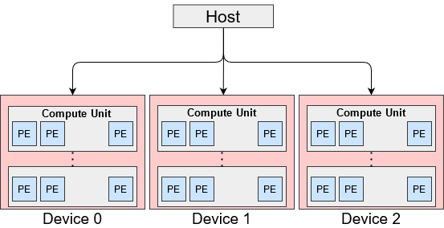

The OpenCL memory model can be divided into two major memories host and device. Host memory is accessible by only the host, and the device memory accessible by kernels executing on OpenCL devices. The device memory can be further divided into global memory (shared by all the work-groups), constant (read-only memory for the device) memory, local memory (shared by all the work-items in a work-group), and private memory (specific to each work-item). 

#### OpenCL Memory Model
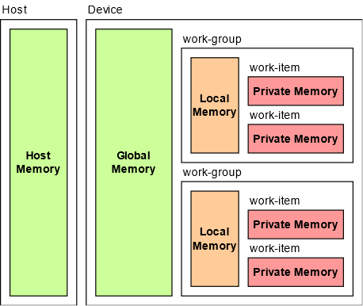

OpenCL supports two types of kernels, namely NDRange kernels and Single-Work-Item (SWI) kernels. In the NDRange kernel, OpenCL generates a deep pipeline as a computing unit. All the work-items from all the work-groups execute on that pipeline. The compiler automatically performs work-group pipelining. NDRange kernel has a similar thread hierarchy to CUDA. Each thread is called a work-item, and multiple work-items are grouped to form a work-group. In the SWI kernels, the entire kernel is run by a single work-item, and loop iterations are pipelined to achieve high performance. Initiation Interval (II) is the number of hardware clock cycles a pipeline must wait for before launching the successive loop iterations.

## Related works
Previous research, which is done under the objective of accelerating ABEA, deployed an accelerated version of the algorithm on GPUs using CUDA. Their implementation is referred to as *f5c-gpu*. They have achieved 3-5x performance improvement on the CPU-GPU system compared to the original CPU version of the nanopolish software package. Rucci et al. has presented Smith-Waterman (SW) implementation, which is capable of aligning DNA sequences of unrestricted size. In this work, the kernel is implemented using the task parallel programming model. Rucci et al. SW kernel, has exploited inter-task parallelism. They have utilized the SIMD (Single Instruction Multiple Data) vector capability available in the FPGA. 
## Methodology and Implementation
The host program executes on the CPU and loads the dataset into the main memory. Then, it programs the FPGA, allocates buffers, sets kernel arguments and finally launches the kernels. When FPGA finishes the execution, the host program reads the results from FPGA and stores them in the main memory. The CPU and FPGA use direct memory access (DMA) to transfer data through PCI-e bus. 

OpenCL supports two types of kernels, namely NDRange kernels and Single-Work-Item (SWI) kernels. In the NDRange kernel, OpenCL generates a deep pipeline as a computing unit. All the work-items from all the work-groups execute on that pipeline. The compiler automatically performs work-group pipelining. NDRange kernel has a similar thread hierarchy to CUDA. Each thread is called a work-item, and multiple work-items are grouped to form a work-group. In the SWI kernels, the entire kernel is run by a single work-item, and loop iterations are pipelined to achieve high performance. Initiation Interval (II) is the number of hardware clock cycles a pipeline must wait for before launching the successive loop iterations.

**A. NDRange Kernel Implementation**
For our NDRange kernel implementation, we followed the GPU approach taken in *f5c-gpu* and re-engineered it to evaluate the performance of OpenCL implementation on FPGA. We broke the main kernel into three sub kernels, namely pre, core, and post. We tried to achieve the maximum benefit of hardware resources and optimal work-group configuration by splitting the kernel.

**B. Single-Work-Item (SWI) Kernel Implementation**
The implementation of SWI kernels is very similar to a typical C program written for CPU and they are best suited for implementing deeply pipelined algorithms. They contain loops. Each loop-iteration is used as the unit of execution of a kernel. Therefore, multiple loop-iterations are computed in different pipeline stage in parallel.The ABEA algorithm can be divided into three main steps. Initialization of first two bands, filling the cells with score value for the rest of the bands, and finally traceback step which finds the best event-space alignment. Out of these three, the second step is highly compute-intensive.

The first step initializes bands and trace arrays, initializes the first two bands and fills an array called 'kmer_ranks'. This array is required in later computations. Rank for each kmer in the sequence is determined by assigning a weight for each base and shifting according to the place of the base within a kmer. This for-loop can be pipelined with an initiation interval of 1 since there are no data or memory dependency between two iterations.

The second step calculates the rest of the bands (b2, b3,..) while moving the adaptive band according to the Suzuki Kasahara rule. Calculation of the current band depends on the previous two bands results. Therefore, the loop has to be serially executed. An inner loop always goes through the band and fills the cells within a band. This loop can be pipelined with a minimum initiation interval of 1 due to the absence of data or memory dependency between loop iterations. The final traceback step consists of a loop with high data dependency between two loop iterations. This behavior results in pipelines with an initiation interval of almost the latency of the pipeline stage. Therefore, it is equivalent to serial execution, which is more suitable for running on a CPU than a SWI kernel on FPGA. According to the above observations, we merged the first step and second step to build a deeply pipelined SWI kernel. Then CPU performs the traceback step. Following figure shows a pipeline diagram including only the main for-loops in the kernel. Computations related to a new read starts its execution in every clock cycle, set of bands in a read executes in a serial manner due to unavoidable data dependencies, and a new cell inside a band starts its execution in every clock cycle. 
### Pipeline Diagram
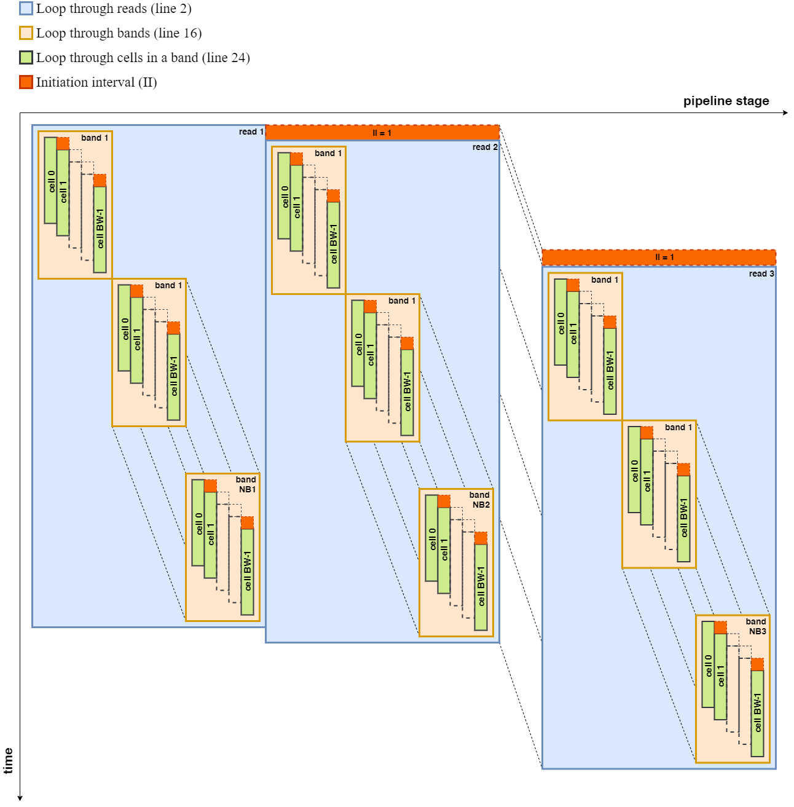

### Pseudo Code for SWI Implementation
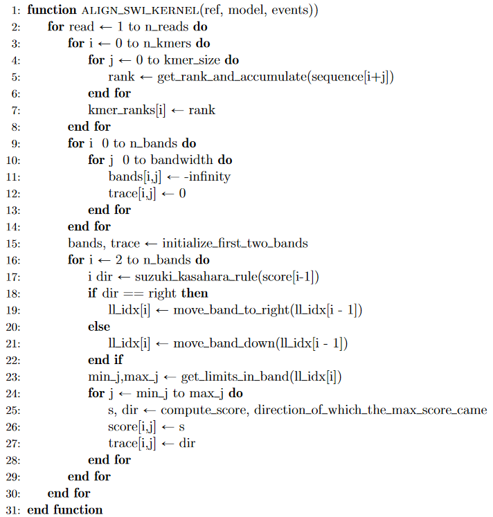

## Experiments and Results
### Experiment Setup
Table below shows specifications of hardware accelerators and the host PC used to obtain results. 

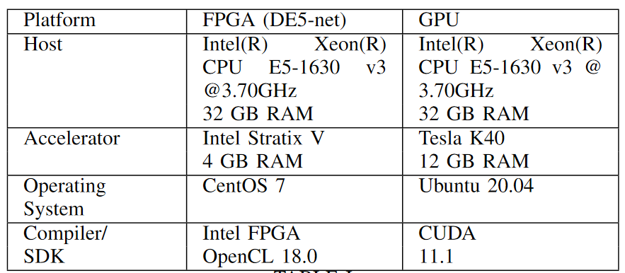

### Dataset
The experimental data set is a subset of publicly available reads aligned to a 2kb region in the E. coli draft assembly and publicly available NA12878 (human genome) ''Nanopore WGS Consortium'' sequencing data. 

The datasets used for the experiments, their statistics (number of reads, total bases, mean read length and maximum read length) are listed below.

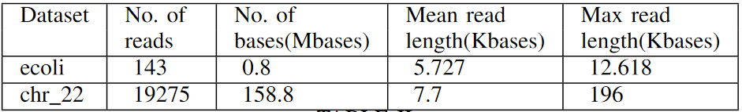

## Performance Results
Detailed analysis of all the loops in SWI kernel is shown below. Apart from the three of the main for-loops mentioned above, other loops are fully unrolled when the lower and upper bounds are constant for each iteration of its outer-loop. Rest of the loops are made to execute in a pipeline manner with an initiation interval of 1. 

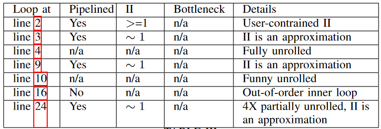

Table below shows the estimated resources used by SWI kernel in the design, all channels, global interconnect, constant cache, and board interface compiled for DE5-net FPGA.

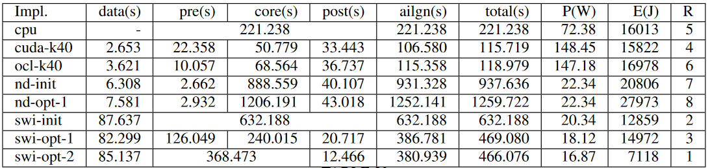

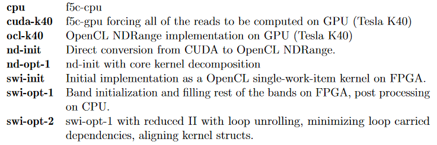

Figures below show the execution time of each implementation and the power consumption of each implementation.

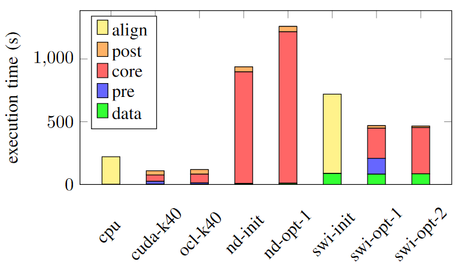

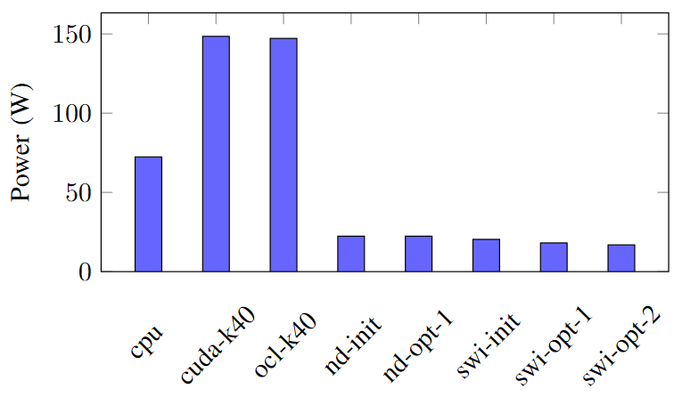

The observations can be analyzed and justified as follows.

Eventhough NDRange kernels on FPGA have a lesser power consumption than GPU implementations, they reported a higher execution time. Therefore, they are ranked at 7 and 8 in terms of the energy consumption.

Usually, *f5c-gpu* allocate a set of very long reads selected according to a heuristic to be computed on the CPU and the rest of the reads on the GPU. It results in around 50 seconds of execution time on Tesla K40. But, here we force the *f5c-gpu* implementation to compute all the reads only on the GPU (*cuda-k40*). We observe that *cuda-k40* and *ocl-k40* perform almost at the same level.

Unlike in FPGAs, in NVIDIA GPUs, Our NDrange OpenCL implementation executes in a similar programming model to CUDA, and it works as a SIMD. When considering CUDA and OpenCL, there are minor differences. The reason for slight execution time degradation in the *ocl-k40* could be the kernel compilation during the execution time.

Due to the lesser execution time of *cuda-k40*, it outperforms the energy advantage of *cpu* and gets ranks 4 and *ocl-k40* gets rank 6.

As mentioned, since the CPU's power requirement is lesser than that of the GPU, based on the energy consumption, the *cpu* implementation gets rank 5.

Among SWI implementations, kernels with suitable FPGA specific optimization techniques shows an improved the performance in execution time and power consumption which lead to less energy consumption. Hence, *swi-opt-2* implementation is in rank 1 and others get rank 2 and 3. 

Among NDRange implementations on FPGA, decomposition of kernels into too many kernels results in poor execution time eventhough the power consumption (estimated for DE5-net) is the same.

Among FPGA implementations, all SWI kernels (*swi-*) perform significantly better than NDRange kernels on FPGA (*nd-*) in terms of both execution time and power consumption. The best SWI kernel is 2x faster and consumes only 34% of the energy compared to the best NDRange kernel.

As shown in Figure, In terms of execution time, GPU implementations (both *cuda-k40* and *ocl-k40*) perform better and 4x faster than *swi-opt-2* on DE5-net.

However, In terms of the energy required to perform ABEA on the same dataset, SWI kernel implementations on FPGA are in lead. *swi-opt-2* on DE5-net needs only 43% of the energy consumption of the GPU implementation on Tesla K40.

## Conclusion
The Adaptive Banded Event Alignment algorithm is an improved version of DNA sequencing, which is extensively used in nanopore DNA sequencing. In the previous work, this algorithm has been parallelized and run efficiently on GPUs. 

In our work, we introduce several implementations of the ABEA algorithm using OpenCL to run on FPGA. We evaluate the performance of the implementations in terms of runtime and energy consumption. 

Among FPGA related implementations, SWI kernel with suitable FPGA specific optimization techniques performs better than other FPGA implementations including NDRange kernel.

In terms of runtime, GPU implementations (both CUDA and OpenCL NDRange kernel) on Tesla K40 perform better and 4x faster than FPGA implementations on DE5-net.

However, in terms of the energy consumption to perform ABEA on the same dataset FPGA implementations are in lead. FPGA implementation on DE5-net needs only 43% of the energy consumption of the GPU implementation on Tesla K40.

Through out our work, we identified the potential and ease of using HLS over traditional methods for hardware programming. We used DE5-net FPGA with OpenCL 18.0 for experimenting and evaluation of results. It is a mid-range hardware compared to the state-of-the-art. 

The maximum predicted frequency we got for the kernels was around 250 Hz and it is even lesser at the execution. The kernel operating frequencies of FPGAs are significantly low compared to CPUs and GPUs. The absence of power sensors in the DE5-net board we had to estimate based on the circuit elements using Intel Quartus Early Power Estimator which they state gives a medium accuracy of the estimate. The true power consumption of kernels may differ due to many other reasons such as the environmental conditions.

Therefore, we believe that with the advancement of FPGA hardware and HLS tools with better optimizations methods can provide better results.

## Publications
1. [Semester 7 report](./assests/reports/sem7_report.pdf)
2. [Semester 7 slides](./assests/reports/sem7_presentation.pdf)
3. [Semester 8 report](./assests/reports/sem8_report.pdf)
4. [Semester 8 slides](./)
5. Author 1, Author 2 and Author 3 "Research paper title" (2021). [PDF](./).

## Links

[//]: # ( NOTE: EDIT THIS LINKS WITH YOUR REPO DETAILS )

- [Project Repository](https://github.com/imsuneth/abea-on-fpga.git)
- [Project Page](https://cepdnaclk.github.io/repository-name)
- [Department of Computer Engineering](http://www.ce.pdn.ac.lk/)
- [University of Peradeniya](https://eng.pdn.ac.lk/)

[//]: # "Please refer this to learn more about Markdown syntax"
[//]: # "https://github.com/adam-p/markdown-here/wiki/Markdown-Cheatsheet"
